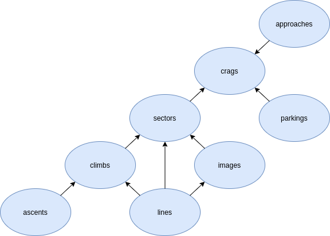

# opencrags-rest-api



## Production

```bash
docker-compose up -d
```

## Development

Everything is automatically installed inside the docker container. The local
source code is mounted and the server watches for changes.

```bash
docker-compose up dev
```

### Install

If you want to change the packages then you need to setup the environment.

#### Recommended
Install pyenv
```bash
curl https://pyenv.run | bash
```

Install python 3.8
```bash
pyenv install 3.8.8
```

#### Install with poetry
Install poetry
```bash
pyenv local 3.8.8
curl -sSL https://raw.githubusercontent.com/python-poetry/poetry/master/get-poetry.py | python -
```

Install python dependencies
```bash
poetry install
```
